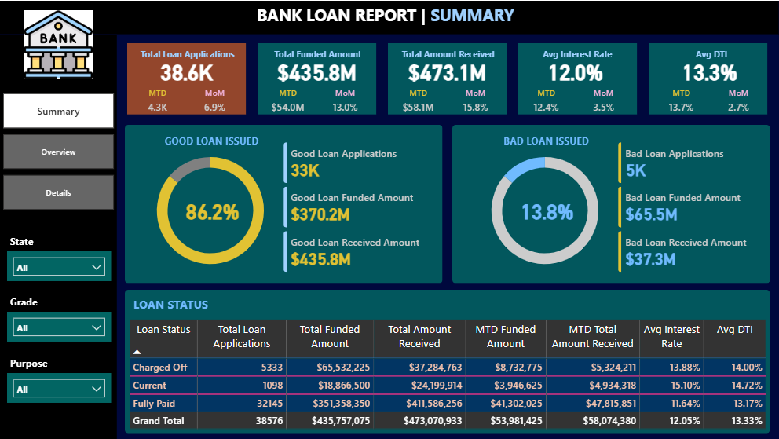

<h1 align="center">🏦 Bank Loan Analysis Dashboard</h1>

<h2>📌 Project Overview</h2>

This project focuses on building an <b>end-to-end Bank Loan Analysis Dashboard</b> 
using <b>Microsoft Power BI</b> and <b>SQL Server Management Studio (SSMS)</b>. 
The objective is to analyze lending data and transform it into meaningful insights 
through interactive dashboards and key performance indicators (KPIs).

The dashboard helps financial stakeholders understand <b>loan portfolio performance, 
customer financial behavior, and lending risks</b>. By visualizing loan applications, 
funded amounts, repayment trends, and borrower characteristics, the project enables 
better decision-making in the financial domain.

<h2>🎯 Business Problem</h2>

Lending institutions must continuously monitor their loan portfolios to assess 
performance and manage financial risk. This dashboard provides insights into:

<ul>
<li>Total Loan Applications and their <b>monthly growth trends</b></li>
<li>Total <b>Funded Amount</b> and <b>Amount Received</b></li>
<li>Average <b>Interest Rates</b> and <b>Debt-to-Income (DTI) ratios</b></li>
<li>Comparison between <b>Good Loans</b> and <b>Bad Loans</b></li>
<li>Performance analysis by <b>Region, Loan Term, and Loan Purpose</b></li>
</ul>

<h2>📂 Dataset Description</h2>

<ul>
<li><b>Source:</b> Kaggle – Financial Loan Dataset</li>
<li><b>Dataset Size:</b> Approximately <b>38,577 rows</b> and <b>24 columns</b></li>
<li><b>Key Fields Include:</b>
    <ul>
        <li>Loan ID</li>
        <li>Address State</li>
        <li>Application Type</li>
        <li>Employee Length</li>
        <li>Loan Purpose</li>
        <li>Loan Status</li>
        <li>Loan Amount</li>
        <li>Funded Amount</li>
        <li>Interest Rate</li>
        <li>Debt-to-Income (DTI)</li>
        <li>Home Ownership</li>
    </ul>
</li>
</ul>

<h2>🛠️ Tools & Technologies Used</h2>

<ul>
<li><b>SQL Server Management Studio (SSMS)</b> – Data importing, writing SQL queries, and calculating KPIs.</li>
<li><b>Power BI Desktop</b> – Data visualization, dashboard development, and interactive reporting.</li>
<li><b>SQL</b> – Data transformation, aggregation, and KPI calculation.</li>
</ul>

<h2>⚙️ Project Workflow</h2>

<ul>

<li><b>Data Import & Cleaning</b> – Imported loan dataset into SQL Server and prepared the data for analysis.</li>

<li><b>SQL Analysis</b> – Wrote SQL queries to calculate key metrics such as total loan applications, funded amounts, and repayment statistics.</li>

<li><b>Data Modeling</b> – Built a custom <b>Date Table</b> in Power BI to enable advanced <b>time intelligence calculations</b>.</li>

<li><b>Dashboard Development</b> – Designed multiple Power BI dashboards to provide different analytical perspectives.</li>

<li><b>Interactive Features</b> – Added filters, slicers, and navigation buttons for dynamic exploration of loan data.</li>

</ul>

<h2>📊 Dashboard Features</h2>

<ul>

<li><b>Summary Dashboard</b>
    <ul>
        <li>High-level KPIs such as Loan Applications, Funded Amount, and Amount Received</li>
        <li>Quick overview of lending performance</li>
    </ul>
</li>

<li><b>Overview Dashboard</b>
    <ul>
        <li>Analysis by <b>State, Loan Purpose, and Loan Term</b></li>
        <li>Dynamic metrics using <b>Field Parameters</b></li>
    </ul>
</li>

<li><b>Details Dashboard</b>
    <ul>
        <li>Detailed grid view of loan records</li>
        <li>Allows granular analysis of individual loan entries</li>
    </ul>
</li>

<li><b>Navigation System</b>
    <ul>
        <li>Interactive buttons for smooth navigation between dashboard pages</li>
    </ul>
</li>

</ul>

<h2>📈 Insights & Key Takeaways</h2>

<ul>
<li>Identified <b>seasonal trends</b> in loan applications and lending activities.</li>
<li>Analyzed customer financial health using <b>average Debt-to-Income (DTI) ratios</b>.</li>
<li>Measured portfolio risk by distinguishing between <b>Good Loans</b> (Fully Paid / Current) and <b>Bad Loans</b> (Charged Off / Late).</li>
<li>Provided insights into <b>regional lending patterns and loan purposes</b>.</li>
</ul>

<h2>📷 Dashboard Preview</h2>

